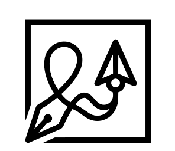

<p align="center">
  
</p>

<h1 align="center">Mouva</h1>

<p align="center">
  <strong>Studio-Grade AI Document & Presentation Designer</strong><br/>
  Design professional documents, presentations, and visual assets — powered by AI.
</p>

<p align="center">
  <a href="https://github.com/leoyounghel-bot/mouva/blob/main/LICENSE.md">
    
  </a>
</p>

<p align="center">
  <a href="https://mouva.ai">Live Demo</a> ·
  <a href="#getting-started">Getting Started</a> ·
  <a href="#features">Features</a> ·
  <a href="#contributing">Contributing</a>
</p>

---

## Demo

https://github.com/user-attachments/assets/63c2bf60-a92a-49bf-a3fa-0207290978f6

> 📹 *AI-powered document generation in action — describe what you need, get a professional design instantly.*

## Features

🤖 **AI-Powered Generation** — Describe what you need in natural language, get professional designs instantly

📄 **Multi-Format Export** — Export to PDF, PPTX, PNG, and more

🎨 **Interactive Canvas Editor** — Drag-and-drop designer with real-time preview

📊 **Smart Tables & Charts** — AI-generated data visualizations

🖼️ **AI Image Generation** — Create and embed custom images directly in your designs

🔤 **Rich Typography** — 80+ fonts including CJK support, art text effects

📐 **Template System** — Start from professional templates or create your own

🌐 **Open Source** — Apache 2.0 licensed, fully self-hostable

## Getting Started

### Prerequisites

- Node.js 18+
- npm 8+

### 1. Clone and Install

```bash
git clone https://github.com/leoyounghel-bot/mouva.git
cd mouva

# Install root dependencies and build core packages
npm install
npm run build
```

### 2. Start the Frontend

```bash
cd playground
cp .env.example .env   # Configure your environment variables
npm install
npm run dev             # Opens at http://localhost:5173
```

### 3. Start the Backend (Optional — for auth, sessions, payments)

```bash
cd playground/server
cp .env.example .env    # Configure database, auth, storage
npm install
npm run dev             # Runs at http://localhost:5800
```

See [playground/server/README.md](playground/server/README.md) for full backend setup.

## Architecture

```
pdfme/
├── packages/           # Core PDF engine (open-source library)
│   ├── common/         # Shared types & utilities
│   ├── generator/      # PDF generation engine
│   ├── schemas/        # Field type plugins (text, image, table, etc.)
│   ├── ui/             # React Designer/Form/Viewer components
│   ├── converter/      # Format conversion
│   └── manipulator/    # PDF merge, split, rotate
├── playground/         # Mouva application
│   ├── src/            # Frontend (React + Vite)
│   └── server/         # Backend API (Express + PostgreSQL)
└── scripts/            # Build utilities
```

## Tech Stack

| Layer | Technology |
|-------|-----------|
| Frontend | React 18, TypeScript, Vite, TailwindCSS |
| PDF Engine | Custom fork of pdf-lib, fontkit |
| AI | Together AI (Kimi-K2.5), Novita AI |
| Backend | Express, PostgreSQL, Cloudflare R2 |
| Auth | JWT, Google OAuth, Magic Links |
| Deployment | Cloudflare Pages (frontend), Azure VM (backend) |

## Contributing

We welcome contributions! Here's how to get started:

1. Fork the repository
2. Create your feature branch (`git checkout -b feature/amazing-feature`)
3. Make your changes and test locally
4. Commit (`git commit -m 'feat: add amazing feature'`)
5. Push to the branch (`git push origin feature/amazing-feature`)
6. Open a Pull Request

### Development Tips

- Run `npm run dev` in individual packages for hot-reload
- Use the playground to test changes in real-time
- Follow [conventional commits](https://www.conventionalcommits.org/)

## Credits

Mouva is built on top of [pdfme](https://github.com/pdfme/pdfme), an excellent open-source PDF generation library. Special thanks to the pdfme team and all contributors.

Additional thanks to:
- [pdf-lib](https://pdf-lib.js.org/) — PDF generation
- [PDF.js](https://mozilla.github.io/pdf.js/) — PDF viewing
- [React](https://reactjs.org/) — UI framework
- [Lucide](https://lucide.dev/) — Icons
- [OpenMoji](https://openmoji.org/) — Emoji support

## License

Apache License 2.0 — see [LICENSE.md](LICENSE.md) for details.

---

<p align="center">
  Made with ❤️ by the Mouva team
</p>
